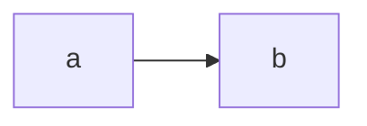
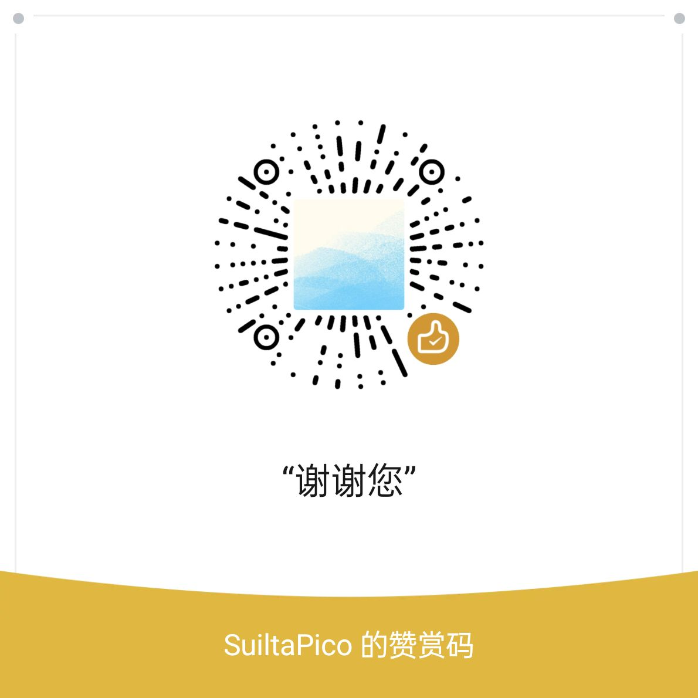

# 毕设文档转译器
## 简介
该软件可以将您的 Markdown 毕业设计文档转换成 Word 文档，让您不用浪费时间在 Word 的格式上，而是直接专注于内容的编写。

本软件可以直接完成这些部分的生成，并保证转换后的格式正确：
- 封面
- 学术诚信声明
- 中英文摘要
- 正文各个章节内容
- 参考文献等末尾章节

本软件额外支持的功能：
- Mermaid：Mermaid 是一门强大的描述语言，您仅需填写文字，就能生成流程图、时序图、类图、状态图、E-R图、甘特图、饼图、UML等各类图标。链接：https://mermaid.js.org

  示例输入：
  ````markdown
  ```mermaid
  flowchart LR
  a --> b & c--> d
  ```
  ````
  输出：
  ```mermaid
  flowchart LR
  a --> b & c--> d
  ```

暂不支持的 Markdown 功能：
- 加粗、斜体、代码块、删除线、高亮
- 超链接
- HTML
- 脚注
- 定义列表
- 任务清单
- LaTeX

## 使用说明
### 第一步：配置您的 `config.toml` 文件
首先，请打开 `config.toml` 文件（可以用记事本打开），并在这里根据提醒进行一些配置。一般来说，我们只需要设置源路径和目标路径：
```toml
# [必填] 源路径：要被转换的 Markdown 文件的位置
# [示例]
# src_path = "D:/毕业设计/几何驱动的图像颜色编辑与应用.md"
src_path = "D:/毕业设计/几何驱动的图像颜色编辑与应用.md"

# [必填] 目标路径：生成的 Docx 放置的位置
# [示例]
# target_path = "D:/毕业设计/几何驱动的图像颜色编辑与应用.docx"
target_path = "D:/毕业设计/几何驱动的图像颜色编辑与应用.docx"
```

### 第二步：为您的 Markdown 添加元信息
接下来，在您的 Markdown 文件的开头添加如下内容，添加完成后，请将冒号后的内容替换成与您的毕设相关的内容：
```yaml
---
# 本文本遵循 YAML 语法

# 题目必须与终稿里面的题目完全一致，一字不差
论文名称: 您的论文名称
院系: 您的院系
# 填写专业全称
专业: 您的专业
学生姓名: 您的姓名
学号: "您的学号"
# 只填写指导老师姓名，不用写职称
指导老师: 您的指导老师
# 年份必须为中文大写
年份: 二〇二四
月份: 五
学术诚信声明日期: 2024 年 3 月 30 日
# 摘要内容应概括地反映出本论文的主要内容，主要说明本论文的研究目的、内容、方法、成果和结论。要突出本论文的创造性成果或新见解，不要与引言相混淆。语言力求精练、准确，以300—500字为宜。
摘要内容: 
  您的摘要内容。
# 关键词是供检索用的主题词条，应采用能覆盖论文主要内容的通用技术词条(参照相应的技术术语标准)。按词条的外延层次排列（外延大的排在前面）
# 本文的关键词（3—5个）。关键词之间以“；”隔开。
摘要关键词: 您的摘要关键词
# 一般情况，首字母除了虚词不需大写，其他都要大写（The，在句前，除外）
# 英文摘要内容与中文摘要相同，以250—400个实词为宜。
英文摘要标题: 您的英文摘要标题
英文摘要内容: 
  您的英文摘要内容。
# 英文摘要关键词用“;”分隔
# 英文关键词 3-5 个
英文摘要关键词: 您的英文摘要关键词
---
```

### 额外步骤：为您的图片增加插图标题
按照论文标准，插图标题的推荐格式为 `图<章节>-<序号><两个空格><插图标题>`，例如：`图2-1  插图标题`。

下面是当您使用不同的图片引用方式时，添加图片标题的三种方法：

#### Markdown
如果您以 Markdown 的语法引用了图片，请在如下位置添加您的图片标题：
```markdown
  | 在这里添加图片标题

```

#### Obsdian
如果您使用 Obsdian，请这样添加图片标题：
```markdown
               | 在这里添加图片标题
![[myimage.png#图2-1  插图标题]]
```

#### Mermaid
如果您的图片是使用 Mermaid 生成的，请这样添加图片标题：
````markdown
              | 在这里添加图片标题
<!--{"name": "图2-1  插图标题"}-->

````

### 最后一步：开始转换
运行 `点我运行.cmd`，等出现“生成成功”的字样，就代表转换完成了。

在打开文档时，会出现弹窗：
```
该文档包含的域可能引用了其他文件。是否更新该文档中的这些域？
是  否
^
点左边这个！
```

请点击“**是**”，以保证目录能自动生成。若您点击了“否”，目录就要您自己生成了。

要注意的是，**新生成的文档会覆盖之前的文档**，所以在生成后的文档编辑过后，建议您先进行“另存为”。

本工具存在一些可能无法被修补的小问题，这些问题需要您手动处理，所以建议您继续往下阅读。

## 目前存在的问题
### [重要] 无法生成完整目录
因为 `python-docx` 的缺陷，“目录”章节需要您去手动 Word 填补一些内容。

1. 请在目录之前，复制如下文本：

    ```
    摘  要	I
    ABSTRACT	II
    ```

    （本文的 PDF 格式这段文字可能被转换了，建议去 `README.MD` 内复制这段文字。）

    然后以原格式粘贴到生成的目录的开头即可。

2. 接下来，按照如下要求设置目录的样式：

    * 1级标题采用四号黑体，不加粗。
    * 2级标题采用小四号宋体，不加粗。

目录就完成了。

### 无法生成表格的续上表
如果表格被分隔到了两页，需要您手动插入“续上表”的文本段。

举例子为：
表 2-2 xxx
|A|B|
|-|-|
|a1|a2|

[页面中断]

续上表 2-2 <----**这段文本无法生成**
|A|B|
|-|-|
|a2|a2|

当前无法实现。

### 其他问题
如果您还发现了其它问题，请去 https://github.com/SuiltaPico/md_to_word/issues/new 这里新增一个反馈。

## 相关链接
- Github: https://github.com/SuiltaPico/md_to_word

## 一些话 🤝
做这个工具实属不易，全程踩坑。在这里非常感谢 Stack Overflow 网站为我提供工具函数和解答的所有人。

如果您希望改进这个项目，欢迎在 GitHub 上 Pull Request 或者直接和我联系。

另外，如果您认为这个软件帮到了您，请送我一支可乐吧🤝：


## 路线图
- [ ] 表格列宽度的设置。
- [ ] 图片宽度的设置。
- [ ] LaTeX 支持。

## FAQ
### 为什么需要用到谷歌浏览器？
因为 Mermaid 的渲染器需要在浏览器上运行。为了方便，就需要自带个谷歌浏览器了。